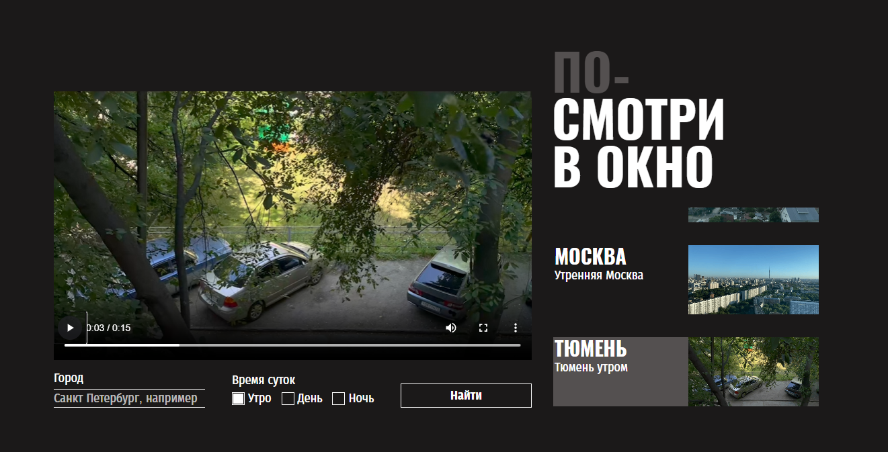

https://github.com/KonstantinBlumenstein/posmotri-v-okno-fd

# Яндекс Практикум, практическая работа "Посмотри В Окно"

## Оглавление

- [Скриншот](#скриншот)
- [Описание](#описание)
- [Автор](#автор)
- [Благодарность](#благодарность)

### Скриншот

### Описание

Это приложение даёт возможность "заглянуть" в окна разных городов по всему миру и увидеть их атмосферу.

## Автор

- Github - [Konstantin Blumenstein](https://github.com/KonstantinBlumenstein)

## Благодарность

Большое спасибо команде Яндекс Практикум за помощь в обучении и предоставленный дизайн.